# Enhanced CLI Agent with Multi-Step Task Coordination

## Overview

The enhanced CLI agent now features intelligent multi-step task coordination with specialized agents for complex task execution. It automatically detects whether tasks require multiple sequential steps and creates detailed execution plans with error handling, retry logic, and user intervention capabilities. The system supports both OpenRouter and OpenAI as AI providers.

## Architecture Deep Dive

### High-Level System Architecture

The CLI Agent implements a sophisticated multi-agent system with hierarchical task orchestration:

```mermaid
graph TD
    A["🚀 CLI Entry Point<br/>(cli.js)"] --> B["🎯 CoordinatorAgent<br/>(coordinatorAgent.js)"]
    B --> C{"🔍 Task Analysis<br/>Multi-step?"}
    C -->|Yes| D["📋 PlannerAgent<br/>(plannerAgent.js)"]
    C -->|No| E["🤖 Basic Agent<br/>(agent.js)"]

    D --> F["📝 Plan Creation<br/>& Storage"]
    F --> G["⚡ ExecutorAgent<br/>(executorAgent.js)"]
    G --> H["🔄 Step-by-Step<br/>Execution"]

    E --> I["🧠 Agent Loop<br/>(Think-Act-Observe)"]
    H --> I

    I --> J["🛠️ Tools Layer<br/>(tools/*)"]
    J --> K["📁 File Operations"]
    J --> L["📄 PDF Processing"]
    J --> M["🔄 Conversions"]
    J --> N["💻 Shell Commands"]

    O["⚙️ Configuration<br/>(config.js)"] --> B
    P["🔗 LLM Providers<br/>(providerFactory.js)"] --> B
    Q["💾 Session Manager<br/>(sessionManager.js)"] --> B
    R["🔍 RAG Retriever<br/>(retriever.js)"] --> B
```



### Core Agent Components

#### 1. CoordinatorAgent - The Orchestration Layer

**Primary Responsibilities:**

- **Task Analysis**: Determines complexity and execution strategy
- **Agent Routing**: Routes tasks to appropriate specialized agents
- **Execution Orchestration**: Manages overall workflow coordination
- **Error Handling**: Provides centralized error management

**Decision Flow:**

```mermaid
graph TD
    A["📨 Task Input"] --> B["🔍 Task Analysis<br/>(detectMultiStepTask)"]
    B --> C{"Multi-step Task?"}

    C -->|No| D["🤖 Single Agent<br/>Execution"]
    D --> E["✅ Direct Result"]

    C -->|Yes| F["📋 Plan Creation<br/>(PlannerAgent)"]
    F --> G["💾 Plan Storage<br/>(.cliagent/plans/)"]
    G --> H["⚡ Step Execution<br/>(ExecutorAgent)"]
    H --> I["🔄 Progress Tracking"]
    I --> J{"More Steps?"}
    J -->|Yes| H
    J -->|No| K["📊 Final Summary"]
```



#### 2. PlannerAgent - The Strategic Mind

**Key Capabilities:**

- **Intelligent Task Decomposition**: Breaks complex tasks into executable steps
- **Plan Persistence**: Stores plans in `.cliagent/plans/` for resumability
- **Dependency Management**: Handles step dependencies and sequencing
- **Risk Assessment**: Evaluates potential issues and mitigation strategies

**Plan Structure:**

```json
{
  "plan_id": "uuid",
  "original_task": "user task",
  "steps": [
    {
      "id": 1,
      "description": "step description",
      "tool": "toolName",
      "parameters": {},
      "success_criteria": "success definition",
      "error_handling": "failure strategy",
      "status": "PENDING|EXECUTING|COMPLETED|FAILED|SKIPPED"
    }
  ],
  "overall_strategy": "High-level approach",
  "risk_assessment": "Potential issues and mitigation"
}
```

#### 3. ExecutorAgent - The Action Engine

**Execution Flow:**

```mermaid
graph TD
    A["📋 Step Input"] --> B["🧠 Think Phase<br/>(Step Analysis)"]
    B --> C["⚡ Action Phase<br/>(Tool Execution)"]
    C --> D["👁️ Observe Phase<br/>(Result Evaluation)"]
    D --> E{"Success?"}

    E -->|Yes| F["✅ Step Complete"]
    E -->|No| G{"Retry Available?"}

    G -->|Yes| H["🔄 Retry Logic"]
    H --> B
    G -->|No| I["❌ Step Failed"]

    I --> J{"Error Handling"}
    J --> K["⏭️ Skip Step"]
    J --> L["🛑 Abort Execution"]
    J --> M["🔧 Manual Fix"]
```



#### 4. Basic Agent - The Foundation

**Think-Act-Observe Loop:**

```mermaid
graph TD
    A["🎯 Task Input"] --> B["🚀 START Mode<br/>(Initialize Context)"]
    B --> C["🧠 THINK Mode<br/>(Analysis & Planning)"]
    C --> D{"Thinking Complete?"}

    D -->|Yes| E["✅ OUTPUT Mode<br/>(Final Result)"]
    D -->|No| F["⚡ ACTION Mode<br/>(Tool Execution)"]

    F --> G["👁️ OBSERVE Mode<br/>(Result Analysis)"]
    G --> H["📝 Update Context<br/>(History & Observations)"]
    H --> I{"Task Complete?"}

    I -->|No| J{"Max Iterations?"}
    J -->|No| C
    J -->|Yes| K["⚠️ Timeout/Error"]

    I -->|Yes| E
    K --> E

    L["🔍 RAG Retrieval<br/>(Context Enhancement)"] --> C
    M["💾 Session Storage<br/>(Persistent Memory)"] --> L
```



### Supporting Infrastructure

#### Session Management & RAG System

```mermaid
graph TD
    A["📨 User Task"] --> B["🔍 RAG Retriever<br/>(retriever.js)"]
    B --> C["💾 Session Manager<br/>(sessionManager.js)"]
    C --> D["📁 Context Storage<br/>(.cliagent/sessions/)"]

    D --> E["📄 context_window.jsonl<br/>(JSONL Format)"]
    E --> F["🔍 Keyword Search<br/>(fast-fuzzy)"]
    F --> G["📊 Top-K Results<br/>(Default: 3)"]
    G --> H["🧠 Enhanced Context<br/>(LLM Input)"]

    I["⚙️ Configuration<br/>(config.js)"] --> C
    I --> J["🎛️ RAG Settings<br/>• topK: 3<br/>• strategy: keyword<br/>• windowSize: 4000"]
```



#### LLM Provider Architecture

```mermaid
graph TD
    A["⚙️ Configuration"] --> B["🏭 Provider Factory<br/>(providerFactory.js)"]
    B --> C{"Provider Type?"}

    C -->|openai| D["🤖 OpenAI Client<br/>(openaiClient.js)"]
    C -->|openrouter| E["🌐 OpenRouter Client<br/>(openrouter.js)"]

    D --> F["🔗 OpenAI API<br/>• GPT-4 Turbo<br/>• GPT-3.5 Turbo<br/>• GPT-4"]
    E --> G["🔗 OpenRouter API<br/>• Multiple Models<br/>• Sarvam-M (Free)<br/>• Claude, Llama, etc."]

    H["💾 Provider Caching<br/>(Singleton Pattern)"] --> B

    F --> I["🧠 LLM Responses"]
    G --> I
```



### Tools Ecosystem

#### Comprehensive Tool Architecture

```mermaid
graph TD
    A["🛠️ Tools Layer<br/>(tools/index.js)"] --> B["📁 File Operations<br/>(fileOps.js)"]
    A --> C["📄 PDF Tools<br/>(pdfTools.js)"]
    A --> D["🔄 Convert Tools<br/>(convertTools.js)"]

    B --> E["💻 Shell Commands<br/>• executeCommand"]
    B --> F["📂 File Management<br/>• createFile<br/>• readFile<br/>• writeFile<br/>• moveFile<br/>• copyFile"]
    B --> G["📁 Directory Ops<br/>• listDirectory<br/>• createDirectory<br/>• searchFiles"]
    B --> H["📊 JSON Handling<br/>• readJSONFile<br/>• writeJSONFile"]

    C --> I["📖 PDF Reading<br/>• extractPDFText<br/>• extractPDFMetadata"]
    C --> J["📝 PDF Creation<br/>• createPDF<br/>• mergePDFs"]

    D --> K["🔄 Format Conversion<br/>• csvToJSON<br/>• jsonToCSV<br/>• xmlToJSON<br/>• jsonToXML"]
    D --> L["📝 Text Processing<br/>• markdownToHTML<br/>• htmlToMarkdown"]
```



#### Tool Categories & Capabilities

**1. File Operations (fileOps.js)**

- **Shell Execution**: `executeCommand()` with timeout & buffer limits (30s, 10MB)
- **File CRUD**: Create, read, write, append, move, copy operations
- **Directory Management**: List, create, search capabilities
- **JSON Utilities**: Specialized JSON file handling with validation
- **System Information**: OS and environment details

**2. PDF Tools (pdfTools.js)**

- **Text Extraction**: Extract text content from PDFs with metadata
- **PDF Creation**: Generate PDFs from text content
- **PDF Manipulation**: Merge, split, watermark operations
- **Metadata Extraction**: Extract PDF properties and information

**3. Conversion Tools (convertTools.js)**

- **Data Format Conversion**: CSV ↔ JSON, XML ↔ JSON with validation
- **Markup Conversion**: Markdown ↔ HTML with proper formatting
- **Structured Data Processing**: Handle various data formats with error handling

### Execution Modes & Output System

#### Output Mode Architecture


### Error Handling & Recovery

#### Multi-Level Error Management

```mermaid
graph TD
    A["❌ Error Occurrence"] --> B{"Error Level?"}

    B -->|Tool Level| C["🔧 Tool Error<br/>(Recoverable)"]
    B -->|Step Level| D["⚡ Step Error<br/>(Retry Logic)"]
    B -->|Plan Level| E["📋 Plan Error<br/>(Skip/Abort)"]
    B -->|System Level| F["🚨 Fatal Error<br/>(Exit)"]

    C --> G["🔄 Retry Tool<br/>(Max 3 attempts)"]
    G --> H{"Success?"}
    H -->|No| I["⚠️ Tool Failed<br/>(Report & Continue)"]
    H -->|Yes| J["✅ Continue Execution"]

    D --> K["🔄 Retry Step<br/>(Max attempts)"]
    K --> L{"Success?"}
    L -->|No| M["�� User Decision<br/>• Skip<br/>• Abort<br/>• Manual Fix"]
    L -->|Yes| J

    E --> N["📊 Plan Status<br/>(Partial Success)"]
    F --> O["🛑 Graceful Exit<br/>(Cleanup & Report)"]
```



### Complete Data Flow Architecture

```mermaid
graph TD
    A["👤 User Input<br/>(CLI Command)"] --> B["🚀 CLI Parser<br/>(commander.js)"]
    B --> C["⚙️ Config Loading<br/>(Environment + File)"]
    C --> D["🎯 CoordinatorAgent<br/>(Task Routing)"]

    D --> E["🔍 Task Analysis<br/>(Multi-step Detection)"]
    E --> F{"Complex Task?"}

    F -->|No| G["🤖 Basic Agent<br/>(Single Loop)"]
    F -->|Yes| H["📋 Planning Phase<br/>(PlannerAgent)"]

    H --> I["💾 Plan Storage<br/>(.cliagent/plans/)"]
    I --> J["⚡ Execution Phase<br/>(ExecutorAgent)"]

    G --> K["🧠 Think-Act-Observe<br/>(Agent Loop)"]
    J --> L["🔄 Step-by-Step<br/>(Executor Loop)"]

    K --> M["🛠️ Tool Execution"]
    L --> M

    M --> N["📁 File System<br/>Operations"]
    M --> O["💻 Shell Command<br/>Execution"]
    M --> P["📄 PDF Processing"]
    M --> Q["🔄 Data Conversion"]

    R["🔍 RAG System<br/>(Context Retrieval)"] --> K
    R --> L

    S["💾 Session Storage<br/>(Persistent Memory)"] --> R

    T["🌐 LLM Provider<br/>(OpenAI/OpenRouter)"] --> K
    T --> L
    T --> H
```



### File System Organization

```
cliagent/
├── src/
│   ├── agent.js              # Basic agent with Think-Act-Observe loop
│   ├── coordinatorAgent.js   # Multi-agent orchestration
│   ├── plannerAgent.js       # Task planning and decomposition
│   ├── executorAgent.js      # Step-by-step execution
│   ├── cli.js               # Command-line interface
│   ├── config.js            # Configuration management
│   ├── sessionManager.js    # Session and context management
│   ├── retriever.js         # RAG implementation
│   ├── providerFactory.js   # LLM provider abstraction
│   ├── openaiClient.js      # OpenAI API client
│   ├── openrouter.js        # OpenRouter API client
│   └── tools/
│       ├── index.js         # Tool aggregation and exports
│       ├── fileOps.js       # File and shell operations
│       ├── pdfTools.js      # PDF processing capabilities
│       └── convertTools.js  # Data format conversions
└── .cliagent/               # User data directory
    ├── config.json          # User configuration
    ├── sessions/            # Session storage
    │   └── {sessionId}/
    │       └── context_window.jsonl
    └── plans/               # Execution plans
        └── {planId}.json
```

### Configuration Architecture

#### Configuration Hierarchy (Priority Order)

1. **Environment Variables** (`.env` file)
2. **User Config File** (`~/.cliagent/config.json`)
3. **Default Values** (Built-in defaults)

#### Key Configuration Parameters

```javascript
{
  llmProvider: "openrouter",           // AI provider selection
  defaultModel: "sarvamai/sarvam-m:free", // Default model
  maxTokens: 2000,                     // Response token limit
  temperature: 0.7,                    // AI creativity level
  contextWindowSize: 4000,             // Session context limit
  ragTopK: 3,                         // RAG retrieval count
  ragRetrievalStrategy: "keyword",     // RAG strategy
  sessionsDir: "~/.cliagent/sessions" // Session storage path
}
```

### Key Technical Features

#### 1. Intelligent Task Routing

- **Automatic Complexity Detection**: Distinguishes single vs. multi-step tasks
- **Context-Aware Agent Selection**: Routes to appropriate specialized agents
- **Dynamic Execution Strategy**: Adapts approach based on task requirements

#### 2. Persistent Execution State

- **Plan Resumability**: Continue interrupted executions across sessions
- **Context Window Management**: Maintains rolling context with intelligent pruning
- **Session-Based Memory**: RAG-enhanced context retrieval for better reasoning

#### 3. Robust Error Handling

- **Multi-Level Recovery**: Tool → Step → Plan → System error handling
- **User-Guided Resolution**: Interactive error resolution with skip/retry options
- **Graceful Degradation**: Continues execution when possible, fails safely when not

#### 4. Flexible Output Modes

- **Human-Readable**: Colored console output with progress indicators
- **Structured JSON**: Machine-readable format for automation
- **Real-Time Tracking**: Live progress updates and status reporting

#### 5. Extensible Tool System

- **Modular Architecture**: Easy addition of new tool capabilities
- **Type-Safe Parameters**: Validated input/output handling
- **Comprehensive Coverage**: File ops, PDF processing, data conversion, shell execution

#### 6. Multi-Provider LLM Support

- **Provider Abstraction**: Seamless switching between OpenAI and OpenRouter
- **Model Flexibility**: Support for various models within each provider
- **Cached Connections**: Efficient provider instance management

This architecture provides a robust, scalable, and intelligent CLI agent system capable of handling both simple commands and complex multi-step workflows with persistent state management and sophisticated error recovery mechanisms.

## Key Features

- **🧠 Intelligent Task Analysis**: Automatically detects multi-step vs single-step tasks
- **📋 Dynamic Plan Generation**: Creates detailed execution plans with dependencies and error handling
- **🔄 Resume & Retry**: Resume interrupted plans and retry failed steps
- **👤 User Intervention**: Interactive prompts for handling failures and modifications
- **📊 Progress Tracking**: Real-time step-by-step execution monitoring
- **💾 Plan Persistence**: All plans saved to disk for recovery and analysis

## Installation

```bash
# Install dependencies (includes OpenAI SDK)
npm install

# Configure your AI provider
cliagent config
```

## Multi-Step Task Coordination

### Architecture

The system uses three specialized agents:

1. **CoordinatorAgent**: Main orchestrator that routes tasks and manages execution
2. **PlannerAgent**: Analyzes tasks and creates detailed execution plans
3. **ExecutorAgent**: Executes individual steps with retry logic and error handling

### Task Detection

The system automatically analyzes incoming tasks to determine complexity:

```bash
# Single-step task (uses original agent)
cliagent run "list files in current directory"

# Multi-step task (creates execution plan)
cliagent run "create a PDF report, compress it, then upload to S3 and email the link"
```

### Execution Modes

#### ANALYZE Mode

- Determines if task is multi-step or single-step
- Provides reasoning and complexity assessment

#### PLAN Mode

- Creates detailed sequential execution plan
- Defines success criteria and error handling for each step
- Saves plan to disk for persistence

#### EXECUTE_PLAN Mode

- Executes steps sequentially
- Handles retries and failures
- Provides real-time progress updates

#### EXECUTE_STEP Mode

- Individual step execution with detailed logging
- Success/failure determination based on criteria
- Retry logic with user intervention options

### Plan Management

```bash
# List all execution plans
cliagent list-plans

# Show details of a specific plan
cliagent show-plan <plan-id>

# Resume a previously interrupted plan
cliagent resume-plan <plan-id>
```

### Example Multi-Step Flow

```json
{
  "mode": "PLAN",
  "status": "CREATED",
  "plan": {
    "id": "abc123...",
    "steps": 4,
    "strategy": "Sequential execution with dependency management",
    "risks": "File upload may fail due to network issues"
  }
}
```

## 4-Mode System (Legacy Single-Step)

### 1. START Mode

- **Purpose**: Initialize task execution
- **Output**: Task description and initial setup
- **JSON Structure**:

```json
{
  "mode": "START",
  "timestamp": "2024-01-15T10:30:00.000Z",
  "task": "user provided task description",
  "iteration": 0
}
```

### 2. THINK Mode

- **Purpose**: AI analyzes the task and plans the approach
- **Features**:
  - Multi-step reasoning (3-4 analysis cycles)
  - Confidence assessment
  - Action planning
- **JSON Structure**:

```json
{
  "mode": "THINK",
  "timestamp": "2024-01-15T10:30:01.000Z",
  "iteration": 1,
  "thinking": {
    "analysis": "Detailed analysis of the situation",
    "considerations": ["factor 1", "factor 2", "factor 3"],
    "plan": "Step-by-step plan for execution",
    "confidence": "high|medium|low"
  },
  "conclusion": "CONTINUE|COMPLETE",
  "nextAction": {
    "tool": "toolName",
    "parameters": { "param1": "value1" }
  },
  "output": "Final output if conclusion is COMPLETE"
}
```

### 3. ACTION Mode

- **Purpose**: Execute tools and commands
- **Features**:
  - Tool execution with timing
  - Error handling
  - Result capture
- **JSON Structure**:

```json
{
  "mode": "ACTION",
  "timestamp": "2024-01-15T10:30:02.000Z",
  "iteration": 1,
  "action": {
    "tool": "listDirectory",
    "parameters": {"dirPath": "/current/directory"},
    "duration": "150ms"
  },
  "result": {
    "success": true,
    "items": [...],
    "count": 5
  },
  "success": true
}
```

### 4. OBSERVE Mode

- **Purpose**: Analyze action results and determine next steps
- **Features**:
  - Result evaluation
  - Continuation logic
  - Final output extraction
- **JSON Structure**:

```json
{
  "mode": "OBSERVE",
  "timestamp": "2024-01-15T10:30:03.000Z",
  "iteration": 1,
  "observation": {
    "actionSuccess": true,
    "actionTool": "listDirectory",
    "result": {...},
    "timestamp": "2024-01-15T10:30:02.000Z"
  },
  "status": "CONTINUE|COMPLETE",
  "finalOutput": "result if status is COMPLETE"
}
```

### 5. OUTPUT Mode

- **Purpose**: Provide final results and summary
- **JSON Structure**:

```json
{
  "mode": "OUTPUT",
  "timestamp": "2024-01-15T10:30:04.000Z",
  "completed": true,
  "iterations": 2,
  "finalOutput": "Task execution results",
  "summary": {
    "totalIterations": 2,
    "actionsPerformed": 1,
    "successfulActions": 1,
    "finalStatus": "completed"
  }
}
```

## Enhanced Tools

### Core Tools

1. **executeCommand(command)** - Execute shell commands with timeout
2. **createFile(filePath, content)** - Create new files with validation
3. **writeFile(filePath, content)** - Write/overwrite files
4. **readFile(filePath)** - Read file contents with metadata
5. **deleteFile(filePath)** - Delete files safely
6. **listDirectory(dirPath)** - List directory contents with details

### New Tools

7. **searchFiles(pattern, directory)** - Search for files matching patterns
8. **getSystemInfo()** - Get comprehensive system information

### PDF Utilities

9. **readPdf(filePath)** - Extract text & metadata from a PDF.
10. **createPdf(content, outputPath)** - Generate a one-page PDF from plain text.
11. **mergePdfs(files, outputPath)** - Merge multiple PDFs.
12. **splitPdf(filePath, ranges, outputDir)** - Split a PDF into pages or ranges.
13. **addPdfWatermark(filePath, watermarkText, outputPath)** - Apply watermark across pages.

### File Conversion

14. **csvToJson(csvPath, jsonPath)** – Convert CSV ➜ JSON.
15. **jsonToCsv(jsonPath, csvPath)** – Convert JSON ➜ CSV.
16. **xmlToJson(xmlPath, jsonPath)** – Convert XML ➜ JSON.
17. **jsonToXml(jsonPath, xmlPath)** – Convert JSON ➜ XML.
18. **markdownToPdf(mdPath, pdfPath)** – Render Markdown ➜ PDF.

#### Example Conversions

```bash
# Extract PDF text
cliagent run "read.pdf filePath=report.pdf" --json

# Convert CSV to JSON
cliagent run "csvToJson csvPath=data.csv jsonPath=data.json" --json

# Markdown to PDF
cliagent run "markdownToPdf mdPath=README.md pdfPath=README.pdf" --json
```

## Usage Examples

### Interactive Mode (Recommended)

```bash
# Start interactive mode (default behavior)
node src/cli.js

# Then type your requests:
# - "list the files in the current directory"
# - "show me system information"
# - "find all .js files in the src directory"
# - Press Ctrl+C to exit
```

### Single Command Mode

```bash
# Run one task and exit
node src/cli.js run "list the files in the current directory"

# Get system information
node src/cli.js run "show me system information"

# Search for specific files
node src/cli.js run "find all .js files in the src directory"
```

### JSON Output Mode

```bash
# Enable structured JSON output
node src/cli.js run "list files" --json

# JSON output with verbose error details
node src/cli.js run "complex task" --json --verbose
```

### Programmatic Usage

```javascript
import { Agent } from "./src/agent.js";
import { config } from "./src/config.js";

const agent = new Agent(config);

// Human-readable output
const result1 = await agent.execute("list files", { json: false });

// Structured JSON output
const result2 = await agent.execute("list files", { json: true });
console.log(JSON.stringify(result2, null, 2));
```

## Error Handling

### Recoverable Errors

The agent can handle and recover from:

- File not found (ENOENT)
- Permission denied (EACCES)
- Command timeouts (ETIMEDOUT)
- Command execution failures

### Error Output Structure

```json
{
  "mode": "ERROR",
  "timestamp": "2024-01-15T10:30:05.000Z",
  "iteration": 2,
  "error": {
    "message": "Error description",
    "recoverable": true,
    "context": "Agent loop execution"
  }
}
```

## OpenAI Support

The CLI Agent now supports both OpenRouter and OpenAI as AI providers, giving you flexibility in choosing your preferred AI service.

### Supported Providers

- **OpenRouter**: Access to multiple AI models through one API (default)
- **OpenAI**: Direct access to OpenAI's models (GPT-4, GPT-3.5, etc.)

### Environment Variables

- `LLM_PROVIDER` - AI provider to use (`openrouter` or `openai`)
- `OPENROUTER_API_KEY` - Your OpenRouter API key
- `OPENAI_API_KEY` - Your OpenAI API key
- `OPENAI_ORG` - Your OpenAI organization ID (optional)
- `CLIAGENT_MAX_ITERATIONS` - Maximum iterations (default: 10)
- `CLIAGENT_TIMEOUT` - Command timeout in ms (default: 30000)

### Setup

```bash
# Configure provider and API keys interactively
cliagent config

# Or set environment variables
export LLM_PROVIDER="openai"
export OPENAI_API_KEY="sk-your-openai-key-here"
export OPENAI_ORG="org-your-organization-id"  # optional
```

### Usage with Provider Selection

```bash
# Use OpenAI for a specific task
cliagent run "analyze this code" --provider openai

# Use OpenRouter for a specific task
cliagent run "generate documentation" --provider openrouter

# Switch provider in interactive mode
cliagent interactive
# Then type: /provider
```

### Provider-Specific Models

**OpenAI Models:**

- gpt-4-turbo
- gpt-4
- gpt-3.5-turbo
- gpt-3.5-turbo-16k
- And more...

**OpenRouter Models:**

- sarvamai/sarvam-m:free
- deepseek/deepseek-r1-0528:free
- anthropic/claude-3.5-sonnet
- openai/gpt-4-turbo (via OpenRouter)
- And many more...

### Interactive Commands

In interactive mode, you can now use:

- `/provider` - Switch between OpenAI and OpenRouter
- `/model` or `/switch` - Switch AI model within current provider
- `/status` - View current provider and model settings

## Configuration

## Testing

### Run Test Suite

```bash
# Run comprehensive tests
node test-agent.js

# Test specific functionality
node src/cli.js run "test task" --json --verbose
```

### Test Cases Included

1. Directory listing with human output
2. System information gathering
3. JSON output formatting
4. Error handling scenarios
5. Multi-iteration workflows

## Advanced Features

### Iteration Control

- **Maximum Iterations**: Prevents infinite loops (default: 10)
- **Smart Completion**: Automatic task completion detection
- **Context Preservation**: Maintains state across iterations

### Output Formatting

- **Human-Readable**: Colored, formatted output for terminal use
- **JSON Mode**: Structured data for programmatic consumption
- **Verbose Mode**: Detailed error information and stack traces

### Tool Enhancement

- **Input Validation**: All tools validate inputs before execution
- **Detailed Results**: Rich metadata in all tool responses
- **Error Recovery**: Graceful handling of tool failures

## Integration Examples

### Parsing JSON Output

```javascript
// Parse agent output for automation
const output = JSON.parse(agentOutput);

switch (output.mode) {
  case "OUTPUT":
    console.log("Task completed:", output.finalOutput);
    break;
  case "ERROR":
    console.error("Task failed:", output.error.message);
    break;
}
```

### Workflow Automation

```bash
#!/bin/bash
# Automated workflow using JSON output

RESULT=$(node src/cli.js run "backup important files" --json)
STATUS=$(echo $RESULT | jq -r '.mode')

if [ "$STATUS" = "OUTPUT" ]; then
    echo "Backup completed successfully"
else
    echo "Backup failed"
    exit 1
fi
```

## Troubleshooting

### Common Issues

1. **API Key Not Set**: Configure OpenRouter API key
2. **Permission Errors**: Ensure proper file/directory permissions
3. **Timeout Issues**: Increase timeout for long-running commands
4. **JSON Parse Errors**: Check for malformed AI responses

### Debug Mode

```bash
# Enable verbose output for debugging
node src/cli.js run "problematic task" --verbose --json
```

## Performance Considerations

- **Iteration Limits**: Prevents runaway processes
- **Command Timeouts**: Prevents hanging on long operations
- **Memory Management**: Efficient handling of large outputs
- **Error Recovery**: Graceful degradation on failures

## Future Enhancements

- [ ] Plugin system for custom tools
- [ ] Parallel action execution
- [ ] Advanced reasoning patterns
- [ ] Integration with more AI providers
- [ ] Web interface for agent management

## Session Management & Retrieval-Augmented Generation (RAG)

The agent now supports **persistent sessions** that maintain a rolling context window on disk and inject the most relevant snippets back into the prompt for better reasoning.

### Commands

```bash
# Create a new session
cliagent new-session

# Run a task inside that session
cliagent run "How do I add RAG?" --session <id>

# Show what the model remembers so far
cliagent show-context <id>

# Clear the context window
cliagent clear-context <id>
```

### Configuration

| Key                 | Description                                 | Default              |
| ------------------- | ------------------------------------------- | -------------------- |
| CONTEXT_WINDOW_SIZE | Max JSONL lines per session                 | 4000                 |
| RAG_TOP_K           | Number of snippets injected                 | 3                    |
| RAG_STRATEGY        | Retrieval strategy (`keyword`, `embedding`) | keyword              |
| SESSIONS_DIR        | Directory for sessions                      | ~/.cliagent/sessions |

Update these values via `cliagent config` or by editing your `.env` file.

### Flow Diagram

1. Each mode output is appended to `context_window.jsonl`.
2. Before THINK, top-K snippets are fetched via `fast-fuzzy` keyword search.
